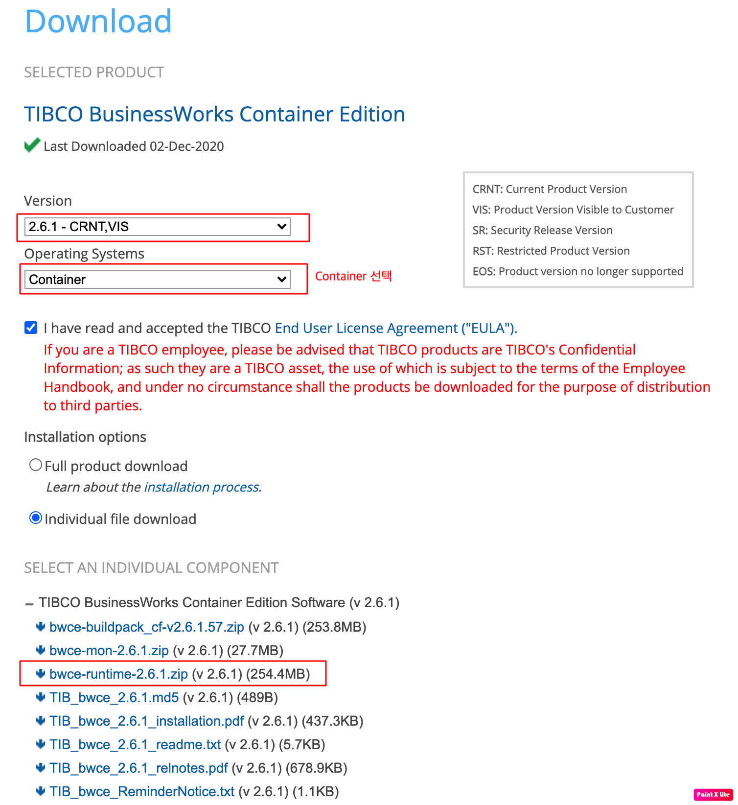
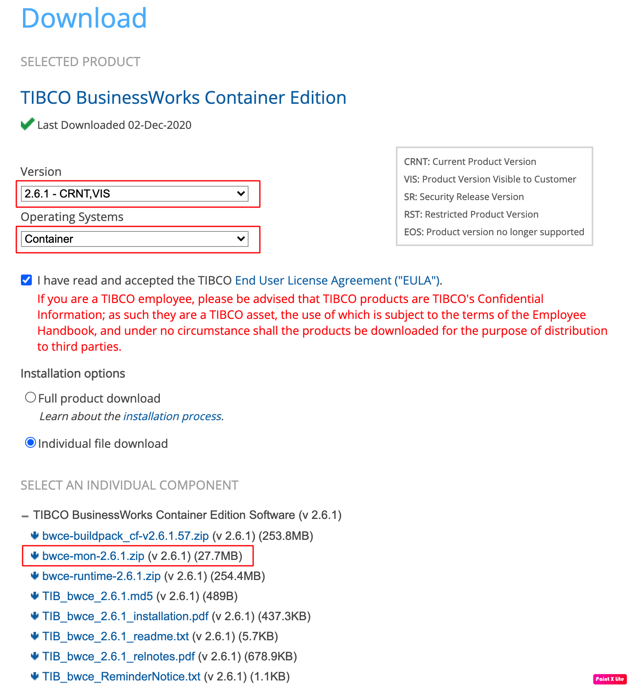

# BWCE Base Docker Image 생성

[toc]

## 1. BWCE Runtime Base Docker Image 생성

BusinessWorks의 어플리케이션을 Docker 환경에서 실행 하기 위한 BWCE의 Runtime Docker 이미지를 생성합니다.

### 1.1 BWCE Container 버전 설치 파일 다운로드

현 블로그 시점 최신 버전인  BWCE Runtime 2.6.1을 https://edelivery.tibco.com/ 에서 다운로드 받습니다.
bwce-runtime-2.6.1.zip 을 다운 받습니다.





### 1.2 BWCE Runtime Docker Image Build
1. 다운 받은 bwce-runtime-2.6.1.zip을 압축 해제 합니다.
```bash
$ unzip bwce-runtime-2.6.1.zip
```
2. bwce-runtime-2.6.1.zip 파일을  `압축해제폴더/tibco.home/bwce/2.6/docker/resources/bwce-runtime` 폴더에 복사합니다.
```bash
$ cp bwce-runtime-2.6.1.zip ./tibco.home/bwce/2.6/docker/resources/bwce-runtime 
```
3. `압축해제폴더/tibco.home/bwce/2.6/docker` 디렉토리로 이동합니다
```bash
$ cd  ./tibco.home/bwce/2.6/docker
```

4. (옵션) Docker Image의 디폴트 OS 변경
BWCE 디폴트 OS는 debian으로 설정되어 있습니다. 디폴트 OS를 변경하기 위해서는 현 폴더의 `Dockerfile` 을 아래와 같이 수정합니다.
- openSUSE
```
FROM opensuse
LABEL maintainer="TIBCO Software Inc."
ADD . /
RUN chmod 755 /scripts/*.sh && zypper -n update && zypper -n refresh && zypper -n in unzip openssh net-tools
ENTRYPOINT ["/scripts/start.sh"]
```
-  Dockerfile content for CentOS 7:
```
FROM centos:7
LABEL maintainer="TIBCO Software Inc."
ADD . /
RUN chmod 755 /scripts/*.sh && yum -y update && yum -y install unzip ssh net-tools
ENTRYPOINT ["/scripts/start.sh"]
```
- openjdk:8-jdk-alpine
```
FROM openjdk:8-jdk-alpine
LABEL maintainer="TIBCO Software Inc."
ADD . /
RUN chmod 755 /scripts/*.sh && apk update && apk add unzip openssh net-tools
ENTRYPOINT ["/scripts/start.sh"]
```
- rhel7-minimal
```
FROM registry.access.redhat.com/rhel7-minimal
LABEL maintainer="TIBCO Software Inc."
ADD . /
RUN chmod 777 scripts/*.sh && microdnf install unzip net-tools --enablerepo=rhel-7-server-rpms && \
microdnf update; microdnf clean all
ENTRYPOINT ["/scripts/start.sh"]
```
- Redhat Standard OS:
```
FROM registry.access.redhat.com/rhel7/rhel
LABEL maintainer="TIBCO Software Inc."
ADD . /
RUN chmod 777 scripts/*.sh && yum install -y unzip ssh net-tools && \
yum update -y; yum clean all
ENTRYPOINT ["/scripts/start.sh"]
```

5. `docker build` 명령어를 통한 Base Image build
```bash
$ sudo docker build -t tibco/bwce:latest -t tibco/bwce:2.6.1 .
```
> -t 옵션을 사용하여 이미지의 태그를 복수로 지정 가능합니다. 최신 버젼을 뜻하는 :latest와 명시적 버전을 태그로 지정 가능합니다.
> 명령어 끝에 . 을 통해 현재 폴더의 Dockerfile 을 디폴트로 읽어서 Docker build를 수행합니다.

6. `docker images` 명령어를 통해 생성된 Base Image를 확인합니다.
```bash
$ docker images
REPOSITORY       TAG        IMAGE ID            CREATED             SIZE
tibco/bwce       2.6.1      12ad1d75b056        7 minutes ago       337MB
tibco/bwce       latest     12ad1d75b056        7 minutes ago       337MB
```
> 상세 설치는 https://docs.tibco.com/pub/bwce/2.6.1/doc/html/GUID-91EA80AA-08EF-4CB3-A6A7-E8551A441AC1.html 를 참조하시기 바랍니다.

  

## 2. BWCE Application Monitoring Base Docker Image 생성

Docker 환경하에서 실행되는 BusinessWorks 어플리케이션의 모니터링을 수행하는 BWCE Application Monitoring Docker 이미지를 생성합니다.

### 2.1 BWCE Container 버전 설치 파일 다운로드

현 블로그 시점 최신 버전인  BWCE Application Monitoring 2.6.1을 https://edelivery.tibco.com/ 에서 다운로드 받습니다.
bwce-mon-2.6.1.zip 을 다운 받습니다.





### 2.2 BWCE Application Monitoring Docker Image Build

1. 다운 받은 bwce-mon-2.6.1.zip을 압축 해제 합니다.
```bash
$ unzip bwce-mon-2.6.1.zip
```

2. `docker build` 명령어를 통한 Base Image build

```bash
$ sudo docker build -t tibco/bwce-mon:latest -t tibco/bwce-mon:2.6.1 .
```
> -t 옵션을 사용하여 이미지의 태그를 복수로 지정 가능합니다. 최신 버젼을 뜻하는 :latest와 명시적 버전을 태그로 지정 가능합니다.
> 명령어 끝에 . 을 통해 현재 폴더의 Dockerfile 을 디폴트로 읽어서 Docker build를 수행합니다.

3. `docker images` 명령어를 통해 생성된 Base Image를 확인합니다.
```bash
$ docker images
REPOSITORY       TAG        IMAGE ID            CREATED             SIZE
tibco/bwce-mon   2.6.1      6cc27daa8dc6        1 minutes ago       148MB
tibco/bwce-mon   latest     6cc27daa8dc6        1 minutes ago       148MB
tibco/bwce       2.6.1      12ad1d75b056        16 minutes ago      337MB
tibco/bwce       latest     12ad1d75b056        16 minutes ago      337MB
```
> 상세 설치는 https://docs.tibco.com/pub/bwce/2.6.1/doc/html/GUID-1B0E3D44-4529-4FBA-867E-73DAC535337F.html 를 참조하시기 바랍니다.

