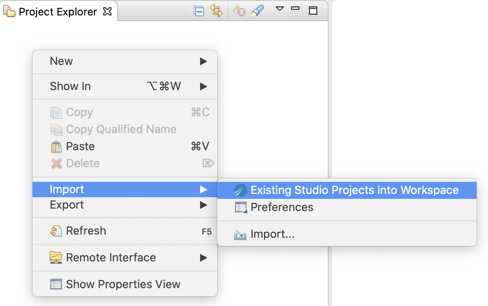
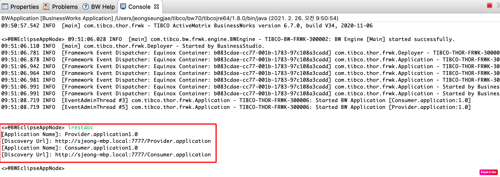
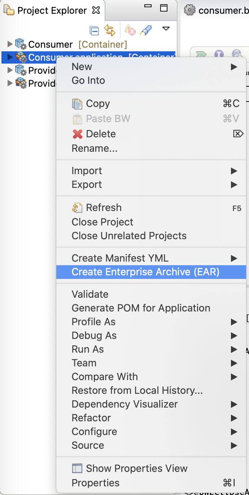

# BWCE Application 실행 on Docker

[toc]

## 1. 환경 이해
### 1.1 BusinessWorks Studio  환경 이해

TIBCO BusinessWorks는 One Source 개발 -> Multi Target 환경 배포를 지원합니다.
따라서 Application을 개발하는 BusinessWorks Studio는 TIBCO ActiveMatrix BusinessWorks™ 6.7.0 과 TIBCO BusinessWorks™ Container Edition 2.6.1 모두 지원합니다.

단,  TIBCO ActiveMatrix BusinessWorks™ 6.7.0의 Studio에서 기존 Application을 Container 환경으로 개발시 Deployment Target을 Container로 변경해 주어야 합니다.

  

  

  

### 1.2 BusinessWorks 샘플 Application 이해 및 소스 다운로드

REST 서비스를 하는 두개의 마이크로서비스 (Consumer, Provider)를 샘플로 구현합니다.
Consumer : 외부의 요청을 받아서 Provider를 호출하고 그 결과값을 외부 요청자에게 전달해 주는 서비스
Provider : 자체적인 서비스를 제공하는 벡엔드 서비스

샘플 Application 다운로드 : [샘플 Git 주소](https://github.com/chungsju/bwce_provider_consumer)

샘플 Application을 Zip 파일로 다운로드 합니다.

## 2. BusinessWorks Studio에서 실행

### 2.1 샘플 Application Import

Project Explore 에서 Import
    

  

Git에서 다운 받은 `bwce_provider_consumer-main.zip` 파일을 Import 합니다.

  

> `bwce_provider_consumer-main.zip` 파일에 Consumer 와 Provider 두개의 Application이 존재합니다. 

### 2.2 샘플 Application 둘러보기

1. Consumer REST 서비스 보기

2. Consumer HTTP Client Resouce 보기

> Consumer가 호출하는 Provider의 HOST와 Port정보가 Module Property(PROVIDER_HOST, PROVIDER_PORT) 로 정의 되어 있습니다.

3. Provider HTTP Connector Resouce 보기

> Provider의 Port정보가 Module Property - PROVIDER_PORT로 정의 되어 있습니다.

4. Consumer Module Property 정보

> Property 정보는 Applicatoin구동시 파라미터 정보로 변경 가능합니다.

### 2.3 샘플 Application Run
1. Run -> Run Configurations -> BusinessWorks Application -> Run

> Consumer 와 Provider 두개의 Application을 체크 합니다.

2. OSGI 명령어로 REST URLs (Swagger UI) 얻기
Console 창에서 `lrestdoc` 을 입력합니다.

> Consumer 와 Provider Application의 REST Discovery Url (Swagger UI) 을 얻습니다.

3. Swagger UI를 통한 REST 서비스 테스트
	- Provider Application의 Swagger UI를 통한 REST 서비스 테스트 
	  
	  브라우저에서 Provider Application의 REST Discovery Url (Swagger UI) 입력
	  
	  Provider -> Try it out -> RequestID 입력 -> Execute 클릭 -> Server Response 결과 값 확인
	  
	
	- Consumer Application의 Swagger UI를 통한 REST 서비스 테스트
	  
	  브라우저에서 Consumer Application의 REST Discovery Url (Swagger UI) 입력
	  
	  Consumer -> Try it out -> RequestID 입력 -> Execute 클릭 -> Server Response 결과 값 확인
	  

### 2.4 샘플 Application EAR 생성
Consumer와 Provider Application의 EAR 파일을 생성합니다.

1. Project Explore ->  Consumer.application -> Create Enterprise Archive(EAR)

	
	
2. Project Explore ->  Provider.application -> Create Enterprise Archive(EAR)

> 각 Provider.application_1.0.0.ear와 Consumer.application_1.0.0.ear 파일이 생성됩니다.

### 2.5 샘플 Application Docker Build

### 2.6 샘플 Application Docker Run

### 2.7 샘플 Application Docker Monitoring

