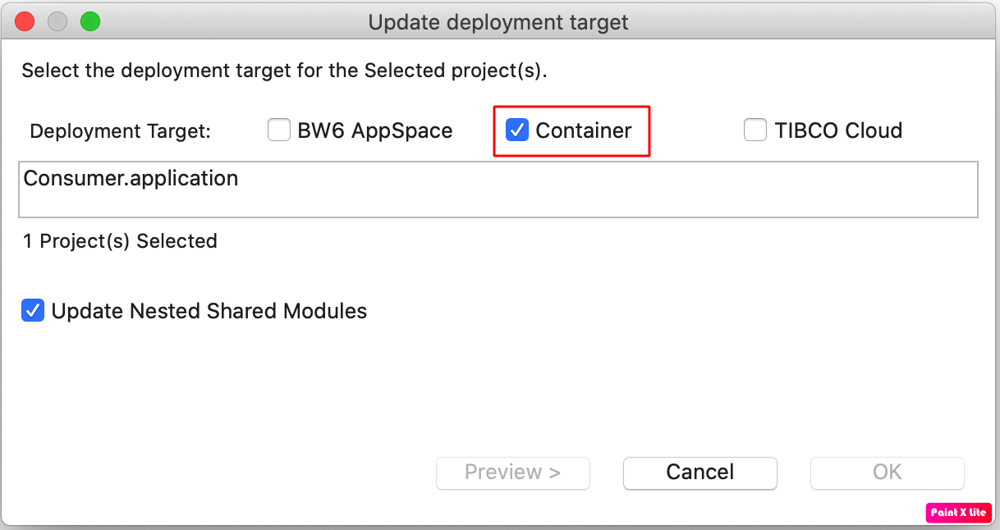

# BWCE Application 실행 on Kubernetes

[toc]

## 1. 환경 이해

앞서 [3.BWCE Application 실행 on Docker](./3.BWCE_App_onDocker.html) 의 작업을 모두 마치셨다면, 4.4 부터 작업을 진행 하시면 됩니다.

### 1.1 BusinessWorks Studio  환경 이해

TIBCO BusinessWorks는 One Source 개발 -> Multi Target 환경 배포를 지원합니다.
따라서 Application을 개발하는 BusinessWorks Studio는 TIBCO ActiveMatrix BusinessWorks™ 6.7.0 과 TIBCO BusinessWorks™ Container Edition 2.6.1 모두 지원합니다.

단,  TIBCO ActiveMatrix BusinessWorks™ 6.7.0의 Studio에서 기존 Application을 Container 환경으로 개발시 Deployment Target을 Container로 변경해 주어야 합니다.

  


  



  

### 1.2 BusinessWorks 샘플 Application 이해 및 소스 다운로드


REST 서비스를 하는 두개의 마이크로서비스 (Consumer, Provider)를 샘플로 구현합니다.
Consumer : 외부의 요청을 받아서 Provider를 호출하고 그 결과값을 외부 요청자에게 전달해 주는 서비스
Provider : 자체적인 서비스를 제공하는 벡엔드 서비스

샘플 Application 다운로드 : [샘플 Git 주소](https://github.com/chungsju/bwce_provider_consumer)

샘플 Application을 Zip 파일로 다운로드 합니다.


## 2. BusinessWorks Studio에서 실행

### 2.1 샘플 Application Import

Project Explore 에서 Import
    


  

Git에서 다운 받은 `bwce_provider_consumer-main.zip` 파일을 Import 합니다.


  

> `bwce_provider_consumer-main.zip` 파일에 Consumer 와 Provider 두개의 Application이 존재합니다. 

### 2.2 샘플 Application 둘러보기

1. Consumer REST 서비스 보기


2. Consumer HTTP Client Resouce 보기

> Consumer가 호출하는 Provider의 HOST와 Port정보가 Module Property(PROVIDER_HOST, PROVIDER_PORT) 로 정의 되어 있습니다.

3. Provider HTTP Connector Resouce 보기

> Provider의 Port정보가 Module Property - PROVIDER_PORT로 정의 되어 있습니다.

4. Consumer Module Property 정보

> Property 정보는 Applicatoin구동시 파라미터 정보로 변경 가능합니다.

### 2.3 샘플 Application Run
1. Run -> Run Configurations -> BusinessWorks Application -> Run

> Consumer 와 Provider 두개의 Application을 체크 합니다.

2. OSGI 명령어로 REST URLs (Swagger UI) 얻기
Console 창에서 `lrestdoc` 을 입력합니다.

> Consumer 와 Provider Application의 REST Discovery Url (Swagger UI) 을 얻습니다.


3. Swagger UI를 통한 REST 서비스 테스트
  - Provider Application의 Swagger UI를 통한 REST 서비스 테스트 
    
    브라우저에서 Provider Application의 REST Discovery Url (Swagger UI) 입력
    
    Provider -> Try it out -> RequestID 입력 -> Execute 클릭 -> Server Response 결과 값 확인
    
  
  - Consumer Application의 Swagger UI를 통한 REST 서비스 테스트
    
    브라우저에서 Consumer Application의 REST Discovery Url (Swagger UI) 입력
    
    Consumer -> Try it out -> RequestID 입력 -> Execute 클릭 -> Server Response 결과 값 확인
    

### 2.4 샘플 Application EAR 생성
Consumer와 Provider Application의 EAR 파일을 생성합니다.

1. Project Explore ->  Consumer.application -> Create Enterprise Archive(EAR)

  
  
2. Project Explore ->  Provider.application -> Create Enterprise Archive(EAR)

> 각 Provider.application_1.0.0.ear와 Consumer.application_1.0.0.ear 파일이 생성됩니다.


## 3 샘플 Application Docker Build
### 3.1 Provider Application Docker Build
#### 3.1.1  Dockerfile 생성

```
$ cat <<EOF | tee Dockerfile_Provider
#BWCE Base Docker 이미지 태그 네임
FROM tibco/bwce:latest                    

#Base Docker에 Copy할 EAR 파일 이름
ADD Provider.application_1.0.0.ear /      
 
#외부 오픈 포트 이름 
EXPOSE 8000

#환경변수 BWCE Module Property에 값 전달
ENV BW_PROFILE Docker
ENV PROVIDER_PORT 8000                    
EOF
```
> ENV 환경 변수는 `docker run -e` 옵션을 통해서도 전달 가능하며, BWCE에서 기본으로 사용되는 환경 변수는 https://docs.tibco.com/pub/bwce/2.6.1/doc/html/GUID-25BD2BA4-6BA4-418C-98D4-6EB3C9196399.html 를 참조하시기 바랍니다.

#### 3.1.2 Docker Build
```bash
$ docker build -t provider:latest -t provider:1.0 -f Dockerfile_Provider .
```

#### 3.1.3 Docker image 결과 확인
```bash
$ docker images
```


### 3.2 Consumer Application Docker Build
#### 3.2.1 Dockerfile 생성
```
$ cat <<EOF | tee Dockerfile_Consumer
#BWCE Base Docker 이미지 태그 네임
FROM tibco/bwce:latest        

#Base Docker에 Copy할 EAR 파일 이름
ADD Consumer.application_1.0.0.ear /      

#외부 오픈 포트 이름  
EXPOSE 7000   

#환경변수 BWCE Module Property에 값 전달
ENV BW_PROFILE Docker
ENV PROVIDER_PORT 8000               
#PROVIDER_HOST (Docker Host IP 혹은 Docker Link의 이름 )
ENV PROVIDER_HOST provider-host           
ENV CONSUMER_PORT 7000                    
EOF
```
> ENV 환경 변수는 `docker run -e` 옵션을 통해서도 전달 가능하며, BWCE에서 기본으로 사용되는 환경 변수는 https://docs.tibco.com/pub/bwce/2.6.1/doc/html/GUID-25BD2BA4-6BA4-418C-98D4-6EB3C9196399.html 를 참조하시기 바랍니다.

#### 3.2.2 Docker Build
```bash
$ docker build -t consumer:latest -t consumer:1.0 -f Dockerfile_Consumer .
```
#### 3.2.3 Docker image 결과 확인
```bash
$ docker images
```

## 4. Docker Registry에 Docker Image 배포

Docker Image가 Build 된 노드와 해당 Docker Image를 이용하여 Container가 구동되는 노드 환경이 다를 경우, 해당 노드에서 Docker Image를 참조하기 위해서는 Docker Registry에 해당 Docker Image를 배포해 주어야 합니다.

### 4.1 Docker Registry 종류

1. Public Docker Registry
[https://hub.docker.com/](https://hub.docker.com/) 에 무료 가입 후 해당 Registry를 활용할 수 있습니다.

2. Private Docker Registry
	- 자체 구성 Private Docker Registry
		
		[https://landscape.cncf.io/](https://landscape.cncf.io/) 에서 Container Registry 영역을 참조하실수 있습니다. 대표적으로 [HARBOR](https://goharbor.io/)를 통해 나만의 Private Docker Registry환경을 구축하실수 있습니다.
	- Cloud 벤더 제공 Docker Registry
		- sdlkfjsdkf
		- sdlkfjsdfk
		- sdlkfjsdklfj
		- slkdjfsdlkfj


##  5. Kubernetes Resource 생성
### 5.1 Application Monitoring 용 Resouce 생성
### 5.2 Provider Application 용 Resouce 생성
### 5.3 Consumer Application 용 Resouce 생성

##  6. Application 검증 및 모니터링
### 6.1 Swagger UI 활용
### 6.1 Swagger UI 활용
