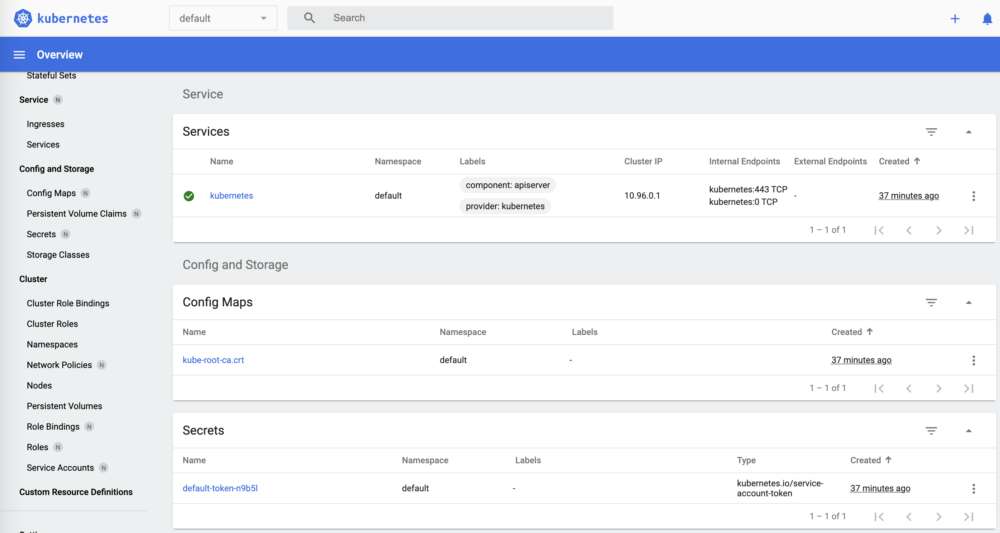
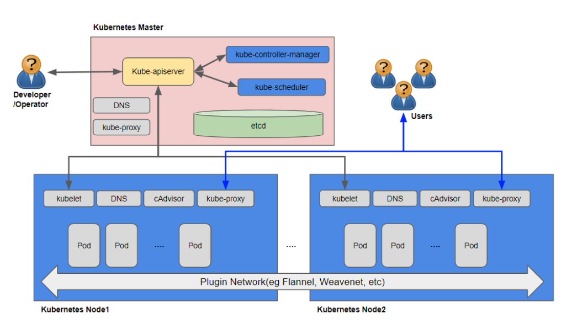

# BWCE 사전 준비사항

[toc]

## 1. 환경 이해

BWCE 환경 구축을 위해서는 Container 엔진 `Docker`와 해당 Container를 자동 배포하고 관리하기 위한 `Kubernetes` 가 필요합니다.
본 Blog에서는 CentOS7 기반으로 작업이 진행 되었습니다.

  

---

  

## 2. Docker 설치

### 2.1 설치 참조 URL
https://docs.docker.com/engine/install/centos/
해당 URL에서 CentOS7 이외에 기타 OS플랫폼에서의 `Docker` 설치 가이드를 참조하실수 있습니다.

### 2.2 Docker yum REPOSITORY 셋업
```{bash}
$ sudo sudo yum install -y yum-utils
$ sudo sudo yum-config-manager \
    --add-repo \
    https://download.docker.com/linux/centos/docker-ce.repo
```

### 2.3 Docker 설치

```{bash}
$ sudo yum install -y docker-ce docker-ce-cli containerd.io
```

### 2.3 Docker 데몬 구동

```{bash}
$ sudo systemctl enable docker
$ sudo systemctl start docker
```

### 2.4 Docker 데몬 확인

```{bash}
$ sudo docker version
Client: Docker Engine - Community
 Version:           20.10.3
 API version:       1.41
 Go version:        go1.13.15
 Git commit:        48d30b5
 Built:             Fri Jan 29 14:34:14 2021
 OS/Arch:           linux/amd64
 Context:           default
 Experimental:      true

Server: Docker Engine - Community
 Engine:
  Version:          20.10.3
  API version:      1.41 (minimum version 1.12)
  Go version:       go1.13.15
  Git commit:       46229ca
  Built:            Fri Jan 29 14:32:37 2021
  OS/Arch:          linux/amd64
  Experimental:     false
 containerd:
  Version:          1.4.3
  GitCommit:        269548fa27e0089a8b8278fc4fc781d7f65a939b
 runc:
  Version:          1.0.0-rc92
  GitCommit:        ff819c7e9184c13b7c2607fe6c30ae19403a7aff
 docker-init:
  Version:          0.19.0
  GitCommit:        de40ad0
```

### 2.5 도커 hub 사용을 위한 계정생성 (옵션)
`docker push` 명령어로 Docker Image를 생성 후  퍼블릭 Docker Hub에 배포하거나 별도 프라이빗 레지스트리(예:  AWS ECR)에 접근 하기 위해서는  `docker login` 이 필요합니다.
```{bash}
sudo docker login
```
> [docker hub](https://hub.docker.com/) (hub.docker.dom) 에 가입 후 퍼블릭 Docker Hub에  로그인이 가능 합니다.

### 2.6 사용자 유저 Docker Group 에 추가 (옵션)
`docker` 커맨드는 기본적으로 root 권한을 필요로 합니다.
일반 사용자 유저에서 `docker`를 사용하기 위해서는 해당 유저를 Docker Group에 추가해 주어야 합니다.

```{bash}
$ sudo groupadd docker
$ sudo usermod -aG docker [non-root user]
```

일반 유저로 Docker 데몬 확인
> 일반 유저가 Docker 그룹에 등록된 후, `docker` 명령어를 실행하기 위해서는 세션 재 접속이 필요합니다.
```{bash}
$ docker version
```

### 2.6 도커 hub 사용을 위한 계정생성 (옵션)

```{bash}
sudo docker login
```

  

---

  


## 3. Kubernetes 설치

### 3.1 Kubernetes 개념
> Kubernetes 상세 개념은 https://kubernetes.io/ko/docs/concepts/ 를 참조 하시기 바랍니다.
> 
Kubernetes는 다음과 같은 기능을 제공해 하며 Container기반의 분산 시스템을 탄력적으로 실행하기 위한 프레임 워크를 제공합니다.


- **서비스 디스커버리와 로드 밸런싱** Kubernetes는 DNS 이름을 사용하거나 자체 IP 주소를 사용하여 Container를 노출할 수 있다. Container에 대한 트래픽이 많으면, Kubernetes는 네트워크 트래픽을 로드밸런싱하고 배포하여 배포가 안정적으로 이루어질 수 있다.
- **스토리지 오케스트레이션** Kubernetes를 사용하면 로컬 저장소, 공용 클라우드 공급자 등과 같이 원하는 저장소 시스템을 자동으로 탑재 할 수 있다.
- **자동화된 롤아웃과 롤백** Container를 사용하여 배포된 Container의 원하는 상태를 서술할 수 있으며 현재 상태를 원하는 상태로 설정한 속도에 따라 변경할 수 있다. 예를 들어 Kubernetes를 자동화해서 배포용 새 Container를 만들고, 기존 Container를 제거하고, 모든 리소스를 새 Container에 적용할 수 있다.
- **자동화된 빈 패킹(bin packing)** Container화된 작업을 실행하는데 사용할 수 있는 Kubernetes 클러스터 노드를 제공한다. 각 Container가 필요로 하는 CPU와 메모리(RAM)를 Kubernetes에게 지시한다. Kubernetes는 Container를 노드에 맞추어서 리소스를 가장 잘 사용할 수 있도록 해준다.
- **자동화된 복구(self-healing)** Kubernetes는 실패한 Container를 다시 시작하고, Container를 교체하며, '사용자 정의 상태 검사'에 응답하지 않는 Container를 죽이고, 서비스 준비가 끝날 때까지 그러한 과정을 클라이언트에 보여주지 않는다.
- **시크릿과 구성 관리** Kubernetes를 사용하면 암호, OAuth 토큰 및 SSH 키와 같은 중요한 정보를 저장하고 관리 할 수 있다. Container 이미지를 재구성하지 않고 스택 구성에 시크릿을 노출하지 않고도 시크릿 및 애플리케이션 구성을 배포 및 업데이트 할 수 있다.
  
  

**[Kubernetes 컴포넌트 구성도]**


### 3.2 kubectl 설치 (Kubernetes client CLI 툴)

`kubectl` 은 Kubernetes  클러스터와 통신하는 커맨드라인 인터페이스 유틸입니다. 따라서 해당 툴은 Kubernetes 서버 환경 이외에 외부에서 접근 하는 client 노드에도 설치가 필요합니다.
```bash
$ curl -LO "https://storage.googleapis.com/kubernetes-release/release/$(curl -s https://storage.googleapis.com/kubernetes-release/release/stable.txt)/bin/linux/amd64/kubectl"
$ chmod +x ./kubectl
$ sudo mv ./kubectl /usr/local/bin/kubectl
```
> `kubectl` 상세 설치 가이드는 https://kubernetes.io/ko/docs/tasks/tools/install-kubectl/ 를 참조하시기 바랍니다.

### 3.3 MiniKube 설치 (Single Node 개발 테스트용)

MiniKube는 Single Node에서 Kubernetes의 기능들을 테스트 해보기 위한 올인원 설치 파일입니다.

#### 3.3.1 MiniKube RPM 설치

```bash
$ curl -LO https://storage.googleapis.com/minikube/releases/latest/minikube-latest.x86_64.rpm
$ sudo rpm -ivh minikube-latest.x86_64.rpm
```
> 상세 설치 가이드는 https://minikube.sigs.k8s.io/docs/start/ 를 참조하시기 바랍니다.

#### 3.3.2 MiniKube Start
```bash
$ minikube start
```
#### 3.3.3 MiniKube 설치 검증
```bash
$ kubectl get po -A
NAMESPACE     NAME                               READY   STATUS    RESTARTS   AGE
kube-system   coredns-74ff55c5b-7nhl5            1/1     Running   0          10m
kube-system   etcd-minikube                      1/1     Running   0          10m
kube-system   kube-apiserver-minikube            1/1     Running   0          10m
kube-system   kube-controller-manager-minikube   1/1     Running   0          10m
kube-system   kube-proxy-m7c57                   1/1     Running   0          10m
kube-system   kube-scheduler-minikube            1/1     Running   0          10m
kube-system   storage-provisioner                1/1     Running   0          10m
```

#### 3.3.3 MiniKube 대쉬보드 
```bash
$ minikube dashboard
🤔  Verifying dashboard health ...
🚀  Launching proxy ...
🤔  Verifying proxy health ...
🎉  Opening http://127.0.0.1:40214/api/v1/namespaces/kubernetes-dashboard/services/http:kubernetes-dashboard:/proxy/ in your default browser...
👉  http://127.0.0.1:40214/api/v1/namespaces/kubernetes-dashboard/services/http:kubernetes-dashboard:/proxy/
```

브라우저로 대쉬보드 접속
http://127.0.0.1:40214/api/v1/namespaces/kubernetes-dashboard/services/http:kubernetes-dashboard:/proxy/


> 해당 대쉬보드의 port는 proxy port 이며, `minikube dashboard`로 proxy 연결시 마다 port가 변경됩니다. 
> 만약 브라우저가 minikube가 설치되어 있는 Node가 아닌 외부에서 접속시에는 해당 노드에 포트 포워딩 접속 후 브라우저 접속을 하면 됩니다.
> 포트 포워딩 접속 예 : `-L localport:127.0.0.1:targetport` 
> ```bash
> ssh -i ~/key.pem centos@15.165.49.47 -L 40214:127.0.0.1:40214
> ```

### 3.4 Kubernetes Cluster 설치 (메뉴얼 Cluster 구성)

#### 3.4.1 Kubernetes 구성도


최대한 운영 환경과 유사한 Kubernetes Cluster 구성을 위해 총 3개의 VM 환경하에 Cluster를 구성하도록 합니다.
1 VM : **Master Node** `kube-apiserver`를 통해 Cluster 전체를 컨트롤 하는 시스템
2 VM : **Worker Noder** API 서버의 요청을 `kubelet`을 통해 수행하고 실제 워크 로드를 생성하여 서비스 하는 시스템

#### 3.4.2 Cluster 구성 공통사항 (Master, Worker Node)


### 3.5 Kubernetes Cloud 서비스 사용