# Spotfire 개발자 가이드

## 1. Spotfire Extension 기본 실습

### 1.1 환경 구성(Spotfire 10.10 기준)

| 구성 항목      | 호환 버전                                                        |
| -------------- | ---------------------------------------------------------------- |
| 운영체제       | Windows 7, Windows 8, Windows 10                                 |
| Visual Studio  | 2013, 2015, 2017, 2019                                           |
| .NET Framework | 4.5.x , 4.6.x, 4.7.x, 4.8.x                                      |
| 제품 설치      | Spotfire Server 및 Spotfire Analyst Clinet 가 설치 되어 있어야함 |

### 1.2 다운로드 항목

다운로드 사이트 : [edelivery.tibco.com](http://edelivery.tibco.com)

| 항목                        | 설명                             |
| --------------------------- | -------------------------------- |
| 개발자용 SDK                | TIB_sfire_dev_10.10.2_win.zip    |
| Spotfire 서버 설치 바이너리 | TIB_sfire_server_10.10.3_win.zip |
| Sptofire 확장팩 바이너리    | TIB_sfire_deploy_10.10.2.zip     |

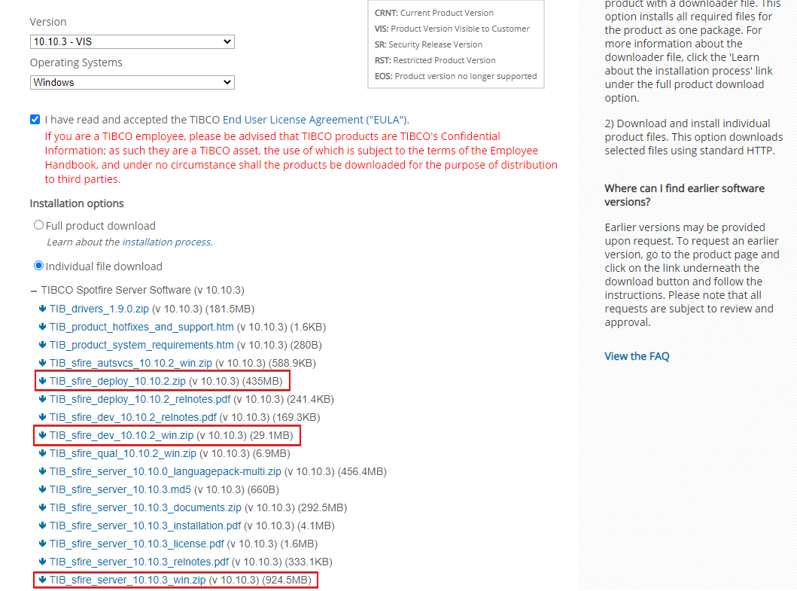

### 1.3 개발자 SDK Template 을 이용한 프로젝트 생성

- **TIB_sfire_dev_10.10.2_win\SDK\Templates** 아래의 **"TIBCO Spotfire Extension VS"**를 복사해서 Visual Studio Templates 디렉토리로 복사

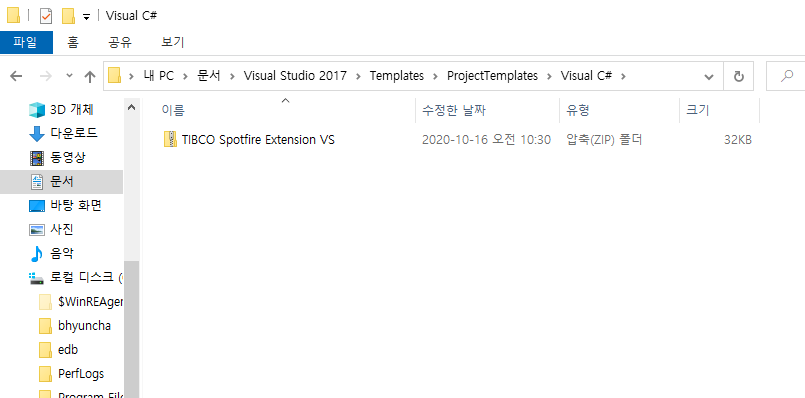

- <kbd>파일</kbd> → <kbd>새로만들기</kbd>→<kbd>프로젝트</kbd> or <kbd>ctr</kbd>+<kbd>shift</kbd>+<kbd>N</kbd>

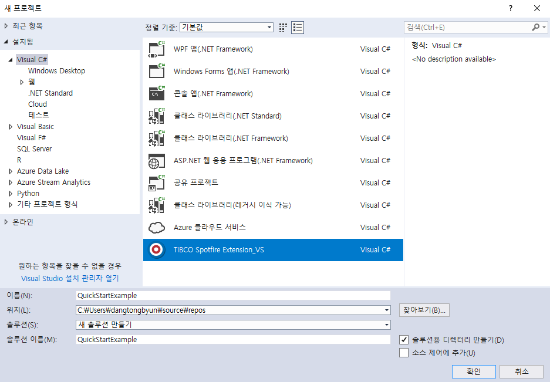

- 그림과 같이 TIBCO Spotfire Extension_VS 를 선택 하고 아래 값을 입력 한뒤 <kbd>확인</kbd> 클릭

| 항목        | 값                |
| ----------- | ----------------- |
| 이름        | QuickStartExample |
| 솔루션 이름 | QuickStartExample |

### 1.4 프로젝트 설정

#### 1.4.1 빌드 설정

**솔루션 탐색기** 에서 오른쪽 마우스 버튼을 눌러 **속성** 을 선택 합니다.

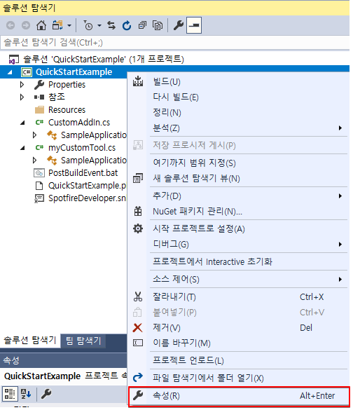

<br>**빌드** → **출력경로** : <프로젝트>\bin\debug 로 설정하되, 없으면 디렉토리를 만들어야함

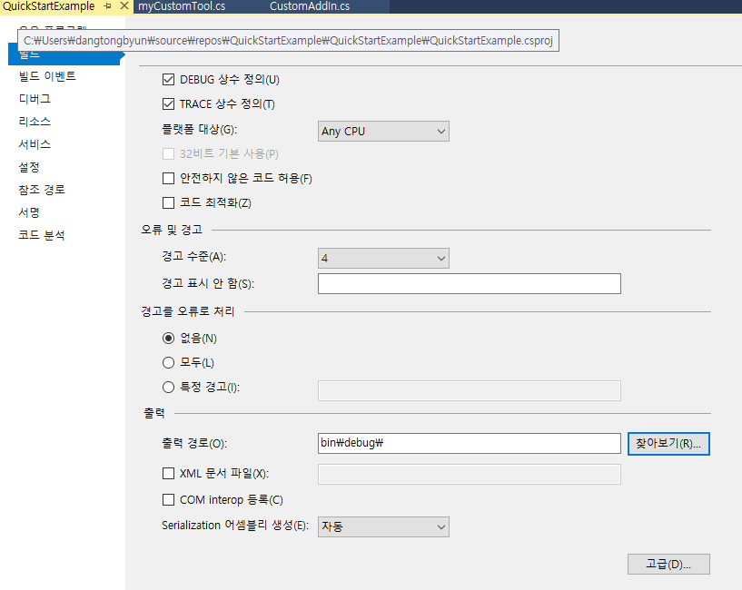

<br>

#### 1.4.2 디버그 설정

**빌드** → **시작 외부 프로그램** : <Spotfire 실행파일 위치>

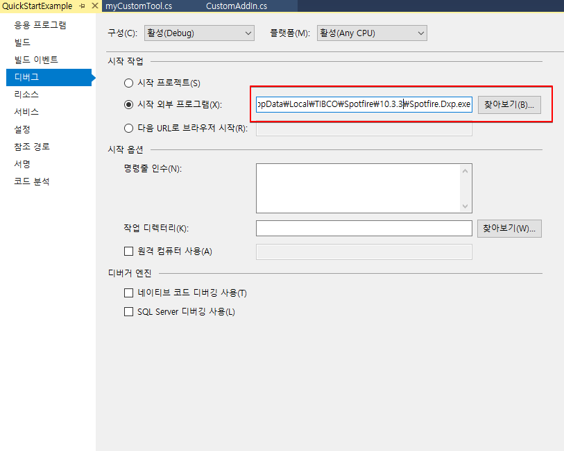

#### 1.4.3 참조 경로 설정

**참조 경로** 에 SDK 의 **Binaries** 디렉토리를 넣어줍니다.

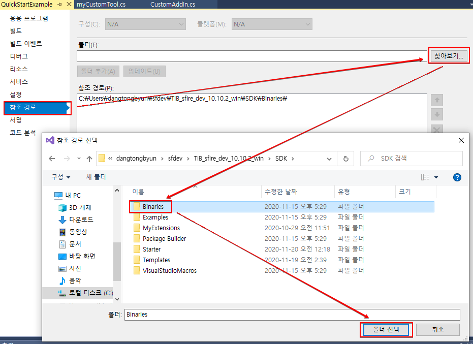

### 1.5 잘못된 참조 삭제 및 신규 참조 추가

#### 1.5.1 참조 제거

아래와 같이 "솔루션 탐색기" 에서 참조 링크가 깨진 것들을 일괄 삭제 합니다.

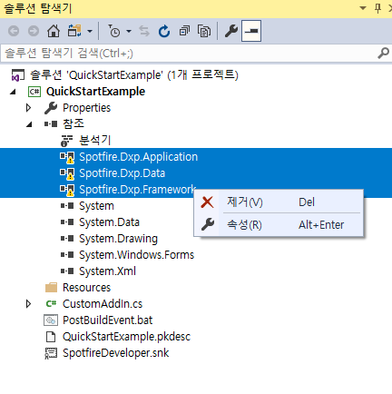

#### 1.5.2 참조 추가

참조 오른쪽 마우스를 클릭하여 <kbd>참조추가</kbd> 를 클릭 합니다.

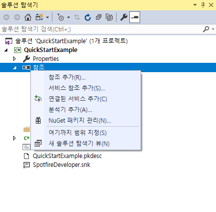

팝업 창이 뜨면 아래와 같이 3개 파일을 선택 하여 <kbd>추가</kbd> 를 클릭 합니다.

| 파일명                       | 설명             |
| ---------------------------- | ---------------- |
| Spotfire.Dxp.Application.dll | 애플리케이션 DLL |
| Spotfire.Dxp.Data.dll        | 데이터 DLL       |
| Spotfire.Dxp.Framework.dll   | 프레임워크 DLL   |

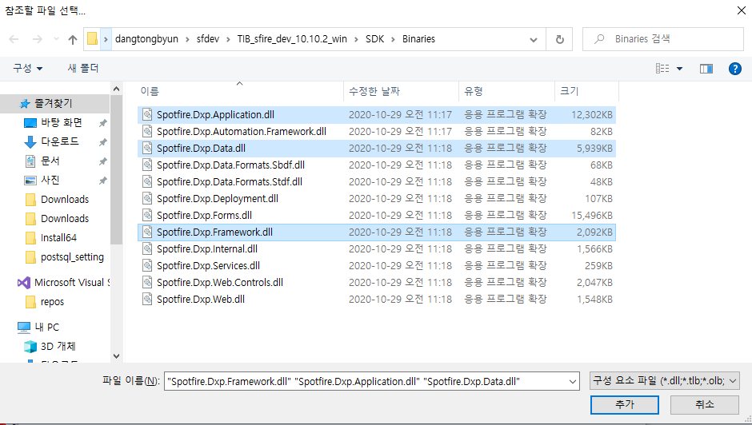

추가한후 3가지 DLL 모두를 선택 한뒤 <kbd>확인</kbd> 을 클릭 합니다.

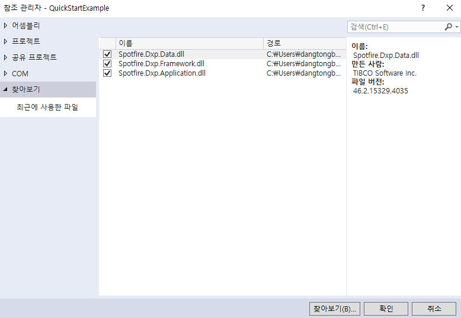

### 1.6 소스 코드 작성

#### 1.6.1 SampleApplicationToolAddIn 작성

"솔루션 탐색기" 에서 CustomAddIn.cs 파일을 더블클릭 합니다.

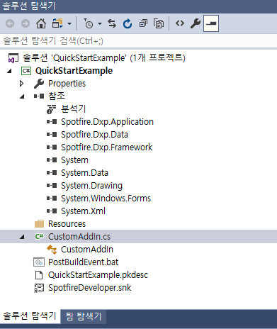

아래와 같이 SampleApplicationTooAddIn 클래스를 작성 합니다.

```{c#}
// CustomAddIn.cs
using System;
using System.Windows.Forms;

using Spotfire.Dxp.Application;
using Spotfire.Dxp.Application.Extension;

namespace QuickStartExample
{
    public class SampleApplicationToolAddIn : AddIn
    {
        protected override void RegisterTools(ToolRegistrar registrar)
        {
            base.RegisterTools(registrar);

            CustomMenuGroup menuGroup = new CustomMenuGroup("AddINPlus");

            registrar.Register(new SampleApplicationTool(), menuGroup);
        }
    }
}
```

#### 1.6.2 클래스 추가

<kbd> 프로젝트</kbd> → <kbd> 클래스 추가</kbd> 를 클릭 합니다.

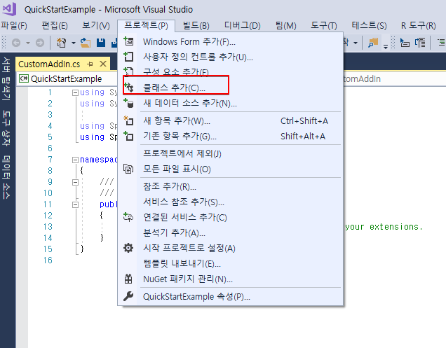

"클래스" 를 선택하고 "이름" 에는 **myCustomTool.cs** 를 입력 합니다.

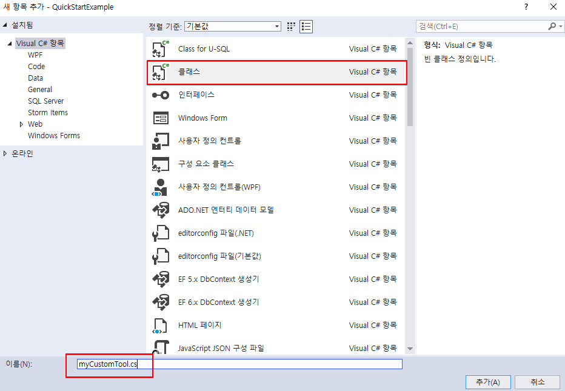

아래와 같이 SampleApplicationTool 클래스를 작성 합니다.

```{c#}
// myCustomTool.cs

using System;
using System.Collections.Generic;
using System.Linq;
using System.Text;
using System.Threading.Tasks;

using Spotfire.Dxp.Application;  // 추가
using Spotfire.Dxp.Application.Extension; //추가

namespace QuickStartExample
{
    public class SampleApplicationTool : CustomTool<AnalysisApplication>
    {
        public SampleApplicationTool()
            : base("&Open \"C:\\Data.dxp\"")
        {
        }
        protected override void ExecuteCore(AnalysisApplication context)
        {
            context.Open(@"C:\Data.dxp");
        }
    }
}
```

### 1.7 패키지 빌더 사용

#### 1.7.1 Configuration 추가

다운받은 개발자 SDK의 패키지 빌더 디렉토리로 이동합니다. [TIB_sfire_dev_10.10.2_win\SDK\Package Builder]

- **Spotfire.Dxp.PackageBuilder** 를 실행 합니다.

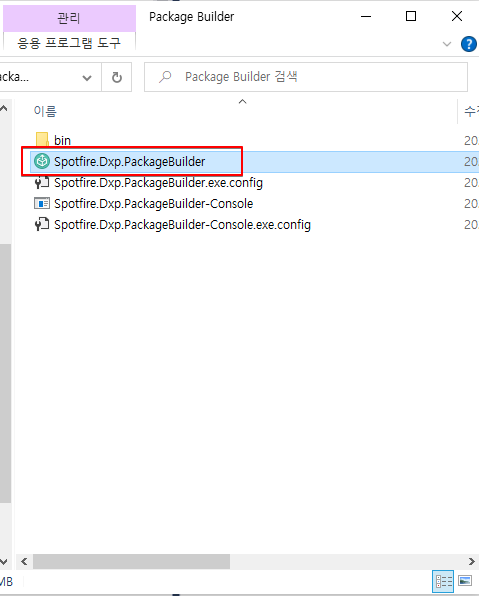

- <kbd>Manage</kbd> → <kbd>Add</kbd>→ "QuickStart" 입력 → <kbd>OK</kbd> 로 신규 Configuration 을 생성 합니다.

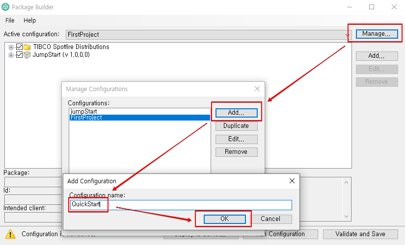

#### 1.7.2 Spotfire Distribution 추가 하기

- <kbd>File</kbd> → <kbd>Add TIBCO Spotfire Distribution</kbd> 클릭

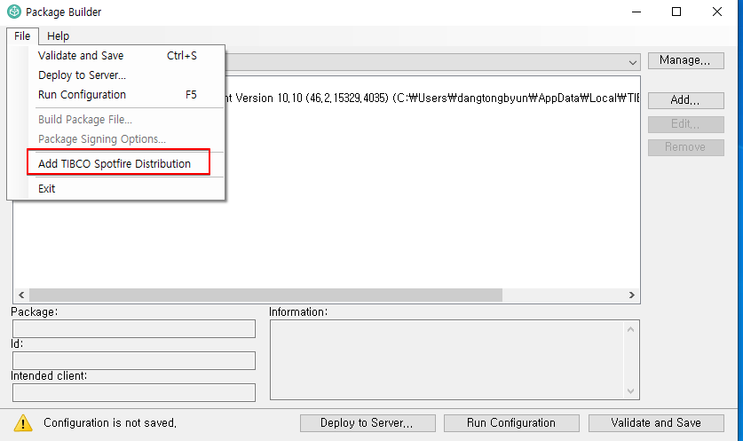

- Spotfire 가 설치된 디렉토리를 선택 하고 <kbd>폴더 선택</kbd> 을 클릭 합니다.


- 아래와 같이 환경이 추가 되었습니다.

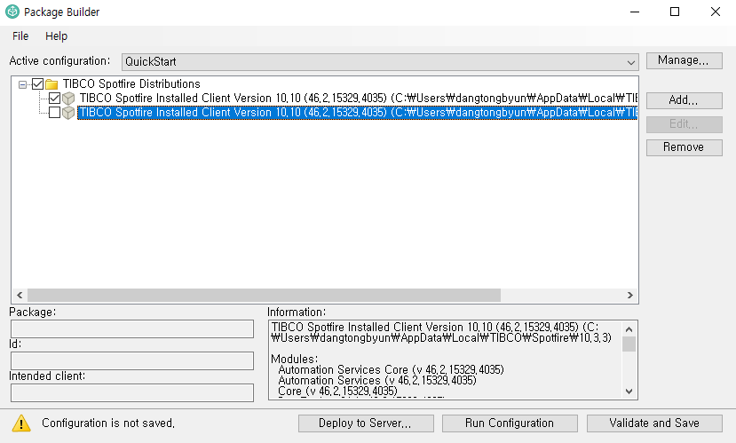

#### 1.7.3 빌드 추가 하기

<kbd>Add</kbd> → <kbd>Browse</kbd> → 빌드대상(프로젝트) 폴더 선택 → <kbd>폴더선택</kbd>

QuickStart 소스의 위치는 일반적으로 C:\Users\<user-name>\source\repos\ 아래에 있습니다.

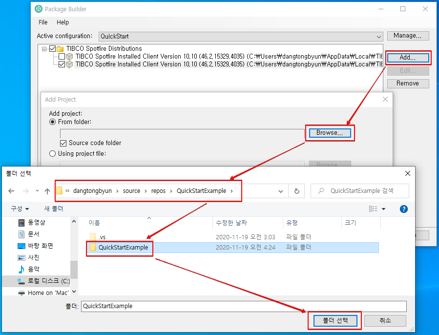

- <kbd>Next</kbd> 를 클릭 합니다.

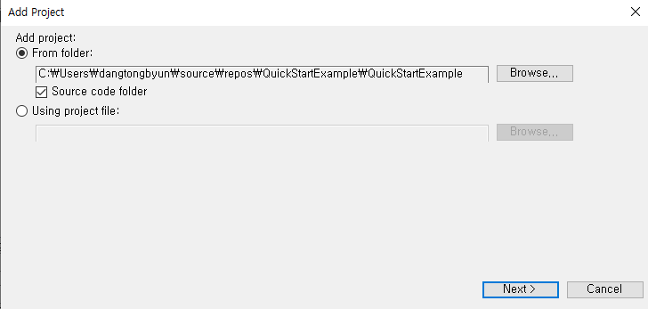

- module.xml 생성을 선택하고 <kbd>Next</kbd> 를 클릭 합니다.

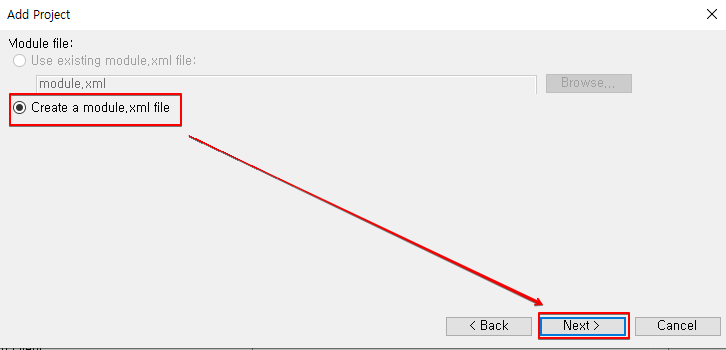

- 프로젝트 이름과 버전을 기록 한뒤 **Finish** 클 클릭 합니다.

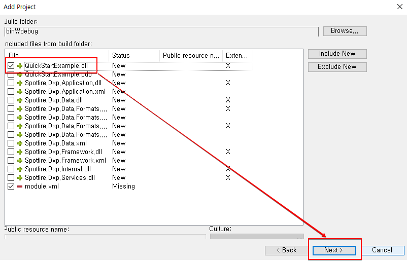

- 프로젝트 이름을 작성 합니다.

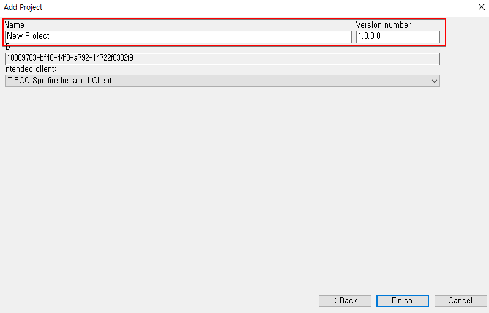

- <kbd> Run Configuration </kbd> 을 클릭 합니다.

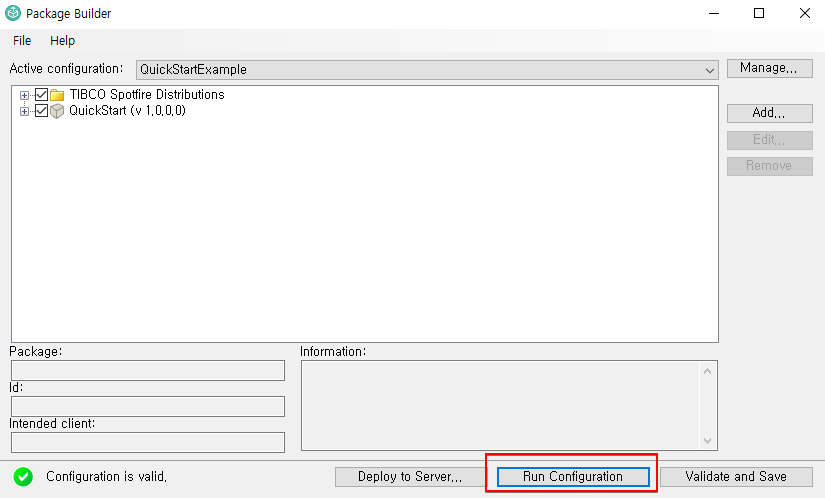

### 1.8 결과 학인

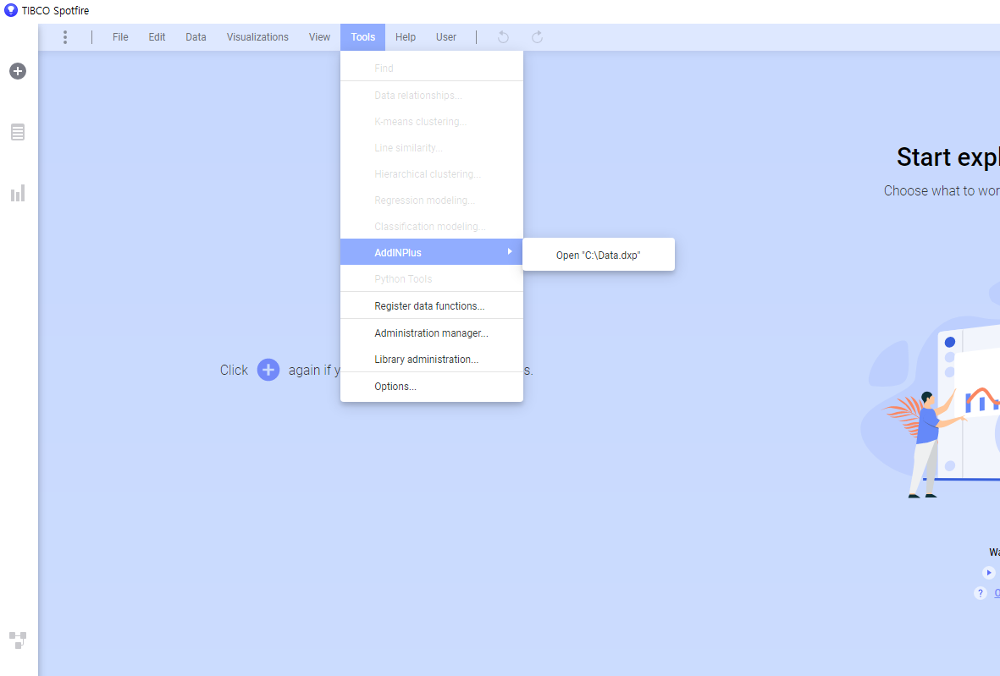

## 2. 확장 패널 추가 프로젝트

### 2.1 프로젝트 생성

**TIBCO Spotfire Extension_VS**로 프로젝트를 생성 합니다.

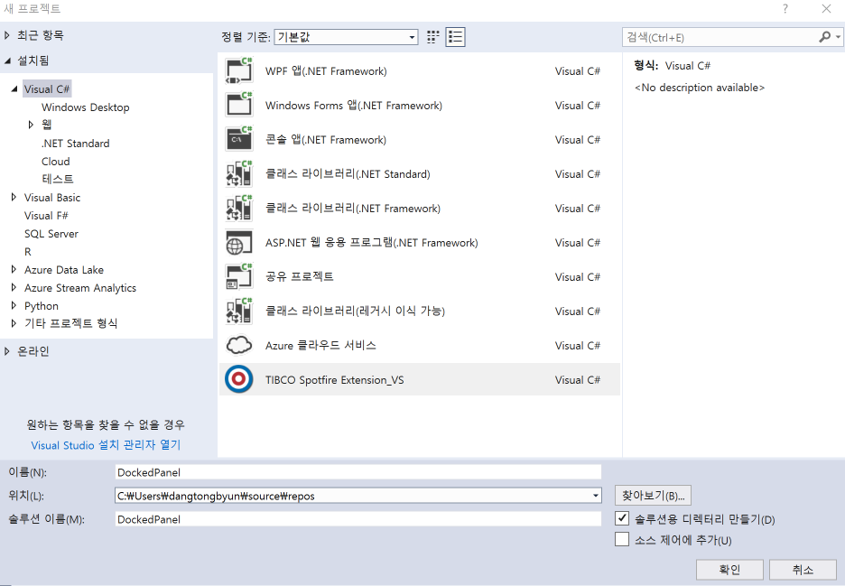

| 항목          | 값          |
| ------------- | ----------- |
| 프로젝트 이름 | DockedPanel |
| 솔루션 이름   | DockedPanel |

### 2.2 참조 제거 및 신규 참조 추가

#### 2.2.1 참조 제거


#### 2.2.2 참조 추가

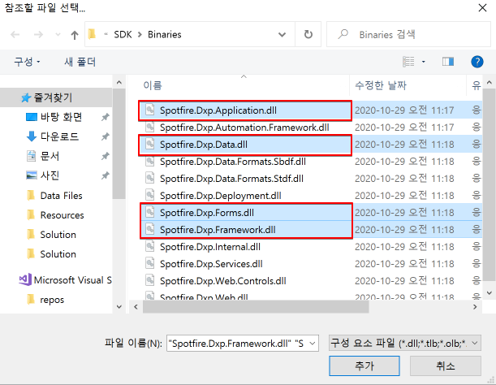

### 2.3 프로젝트 설정

#### 2.3.1 빌드 설정

- **솔루션 탐색기** 에서 오른쪽 마우스 버튼을 눌러 **속성** 을 선택 합니다.


- **빌드** → **출력경로** : <프로젝트>\bin\debug 로 설정하되, 없으면 디렉토리를 만들어야함


#### 2.3.2 디브그 설정

- **빌드** → **시작 외부 프로그램** : <Spotfire 실행파일 위치>


#### 2.3.3 참조 경로 설정

- **참조 경로** 에 SDK 의 **Binaries** 디렉토리를 넣어줍니다.


#### 2.3.4 Icon 설정

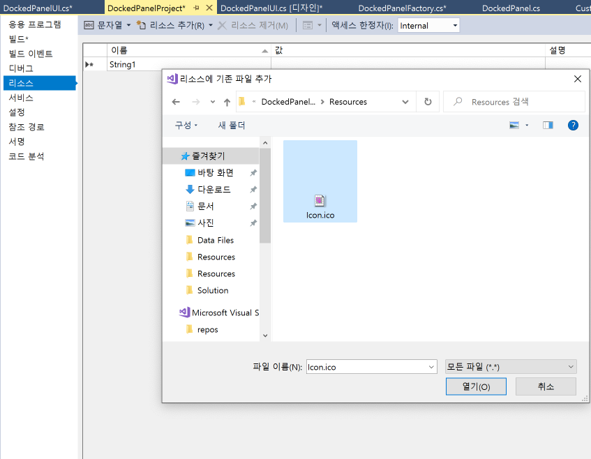

### 2.4 소스 코드 작성

- <kbd>프로젝트</kbd> → <kbd>클래스추가</kbd> → <kbd>클래스</kbd> → DockedPanel.cs 생성
- <kbd>프로젝트</kbd> → <kbd>클래스추가</kbd> → <kbd>클래스</kbd> → DockedPanelFactory.cs 생성
- <kbd>프로젝트</kbd> → <kbd>클래스추가</kbd> → <kbd>사용자정의 컨트롤</kbd> → DockedPanelUI.cs 생성

#### 2.4.1 CustomAddIn.cs 작성

```{c#}
using System;
using System.Windows.Forms;

using Spotfire.Dxp.Application;
using Spotfire.Dxp.Application.Extension;

namespace DockedPanel
{
    public sealed class CustomAddIn : AddIn
    {
        protected override void RegisterViews(ViewRegistrar registrar)
        {
            base.RegisterViews(registrar);
            registrar.Register(typeof(Control), typeof(DockedPanel), typeof(DockedPanelUI));
        }

        protected override void RegisterPanels(AddIn.PanelRegistrar registrar)
        {
            base.RegisterPanels(registrar);
            registrar.Register(new DockedPanelFactory());
        }
    }
}

```

#### 2.4.2 DockedPanel.cs 작성

<kbd>프로젝트 </kbd> → <kbd>클래스 추가</kbd> → DockedPanel.cs 생성

```{c#}
using System;
using Spotfire.Dxp.Application.Extension;

namespace DockedPanelProject
{
    public class DockedPanel : CustomPanel
    {
        public DockedPanel()
            : base()
        { }
    }
}
```

#### 2.4.3 DockedPanelFactory.cs 작성

```{c#}
using System;
using System.Collections.Generic;
using System.Linq;
using System.Text;
using System.Threading.Tasks;

using DockedPanelProject.Properties;
using Spotfire.Dxp.Application.Extension;
using Spotfire.Dxp.Application.Layout;

namespace DockedPanelProject
{
    class DockedPanelFactory : CustomPanelFactory<DockedPanel>
    {
        // Identifier 를 파라메터로 전달하고, 패널의 위치와 아이콘을 설저앻 줍니다.
        public DockedPanelFactory()
               : base(FirstProjectIdentifiers.FirstProjectPanel,
                       Resources.Icon.ToBitmap(),
                       new PanelPlacement(PanelRegion.Left, 3, false), null)
        {
            // Empty
        }
        protected override DockedPanel CreateCore(IServiceProvider context)
        {
            return new DockedPanel();
        }
    }
}
```

#### 2.4.4 DockedPanelUI.cs 작성

- Panel 디자인


- Panel 소스

UI 를 더블 클릭해서 아래와 같이 수정 합니다.

```{c#}
using System.Collections.Generic;
using System.ComponentModel;
using System.Drawing;
using System.Data;
using System.Linq;
using System.Text;
using System.Threading.Tasks;
using System.Windows.Forms;

namespace DockedPanelProject
{
    public partial class DockedPanelUI : UserControl
    {
        private DockedPanel panel;

        public DockedPanelUI()
        {
            InitializeComponent();
        }
       // 패널을 파라메터로 받는 생성자를 추가로 작성 합니다.
        public DockedPanelUI(DockedPanel panel) : this()
        {
            this.panel = panel;
            InitializeComponent();
        }

        private void DockedPanelUI_Load(object sender, EventArgs e)
        {
        }

        private void button1_Click(object sender, EventArgs e)
        {
        }

        private void label1_Click(object sender, EventArgs e)
        {
        }
    }
}
```

소스코드를 모두 작성 한 다음 패키지 빌더를 이용해 테스트 합니다.

### 2.5 프로젝트 결과

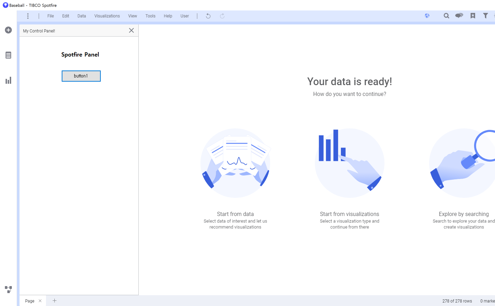

## 3. 패널에 파일 열기 기능 추가

### 3.1 UI 수정

#### 3.1.1 UI 추가 수정 및 추가

- **Button** 도구를 추가 하고 **Text** 를 Open 으로 변경 합니다.

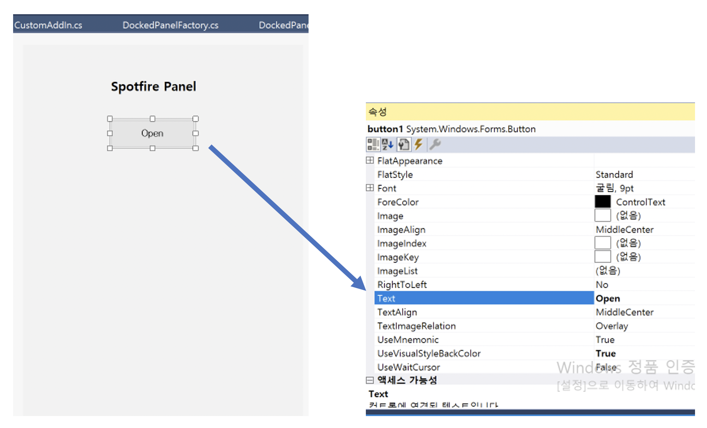

#### 3.1.2 파일 다이얼 로그 추가

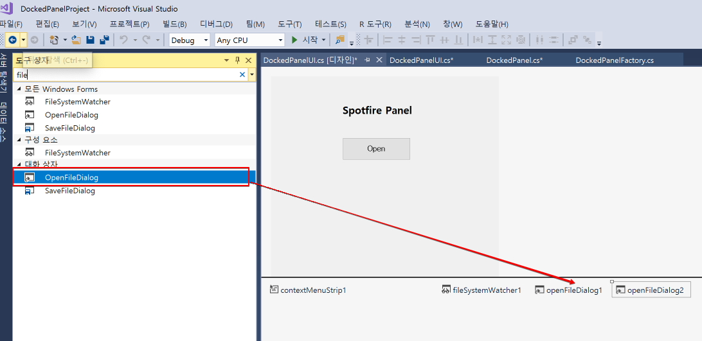

### 3.2 소스 추가 생성

#### 3.2.1 DockedPanel.cs 코드 추가

```{c#}
// 3.2 추가 라이브러리
using System;
using Spotfire.Dxp.Application.Extension;
// 3.3 추가 라이브러리
using Spotfire.Dxp.Data;
using Spotfire.Dxp.Data.Import;
using Spotfire.Dxp.Application;
using Spotfire.Dxp.Framework.Persistence;
using System.Runtime.Serialization;
using System.IO;
using System.Reflection;


namespace DockedPanelProject
{
    // Serialization 설정 추가
    [Serializable]
    [PersistenceVersion(1, 0)]
    // 추가 END
    public class DockedPanel : CustomPanel
    {
        public DockedPanel()
            : base()
        { }
        // createDataTable 함수 추가
        internal void createDataTable(String Path)
        {
            AnalysisApplication mainApp = GetService<AnalysisApplication>();
            DataSource TableDS = new TextFileDataSource(GetAsResourcePath(Path), null);

            DataTable myDataTable = mainApp.Document.Data.Tables.Add("My Data Table", TableDS);
        }
        // 추가 END
        private TService GetService<TService>()
        {
            return (TService)this.GetService(typeof(TService));
        }

        private string GetAsResourcePath(string resourceFileName)
        {
            string executionDirectory = Path.GetDirectoryName(Assembly.GetExecutingAssembly().Location);
            string resourceDirectory = Path.Combine(executionDirectory, "Resources");

            return Path.Combine(resourceDirectory, resourceFileName);
        }
        // Serializable 추가
        #region ISerializable Members
        public DockedPanel(SerializationInfo info, StreamingContext context)
            : base(info, context)
        { }
        #endregion ISerializable Members
        // 추가 END
    }
}
```

#### 3.2.2 DockedPanelUI.cs 코드 추가

DockedPanelUI.cs 에서 <kbd>Open</kbd> 을 더블 클릭해서 아래와 같이 추가 합니다.

```{c#}
private void button1_Click(object sender, EventArgs e)
{
            String file_path = null;
            openFileDialog1.InitialDirectory = "C:\\";
            if(openFileDialog1.ShowDialog() == DialogResult.OK)
            {
                file_path = openFileDialog1.FileName;
                this.panel.createDataTable(file_path);
            }
}
```

### 3.3 결과 확인

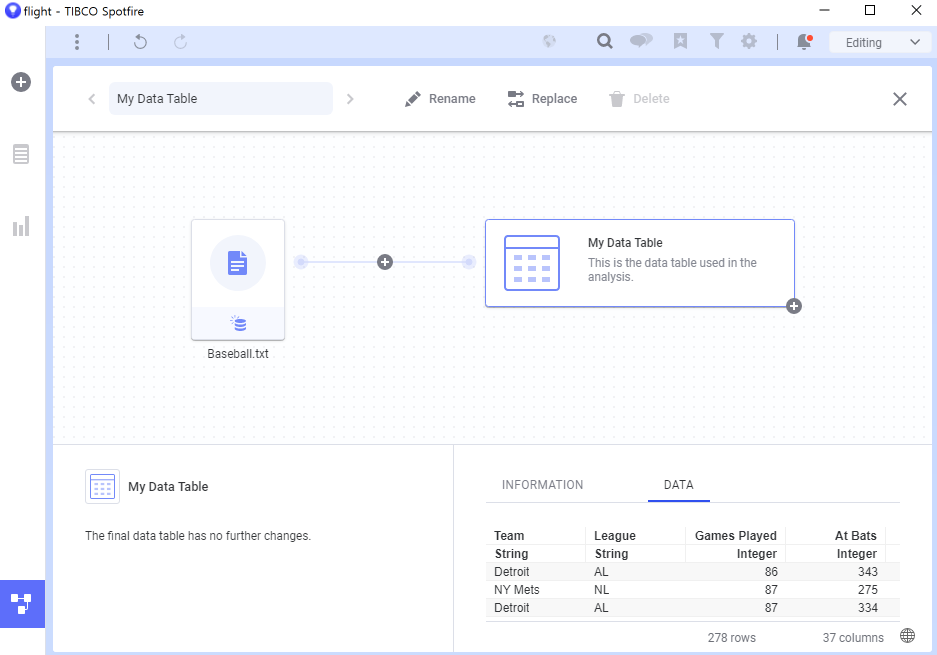

## 4. Panel에 BoxPlot 생성 기능 추가

### 4.1 DockedPanel.cs 에 소스 추가

```{c#}
using Spotfire.Dxp.Application.Visuals;

internal void createBarChart()
{
     AnalysisApplication mainApp = GetService<AnalysisApplication>();
     BarChart barChart1 = mainApp.Document.ActivePageReference.Visuals.AddNew<BarChart>();
     //BarChart barChart1 = mainApp.Document.Pages[pageCount-1].Visuals.AddNew<BarChart>();
     barChart1.ApplyUserPreferences();
     barChart1.AutoConfigure();
     barChart1.YAxis.Expression = "Avg([Hits])";
     barChart1.XAxis.Expression = "<Team>";
     barChart1.ColorAxis.Expression = "<Team>";
     barChart1.BarWidth = 70;
     barChart1.Title = "Sample Bar Chart";
}
```

### 4.2 DockedPanelUI.cs 에 소스 추가

```{c#}
private void button2_Click(object sender, EventArgs e)
{
     this.panel.createBarChart();
}
```

### 4.3 결과 확인

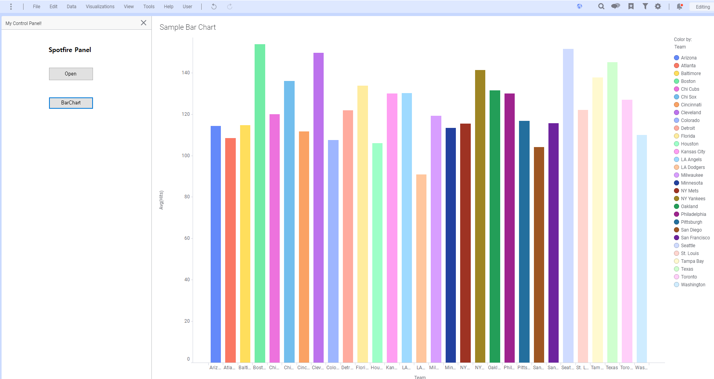

## 5. 패널에 계산된 컬럼 추가 기능 구현

### 5.1. DockedPanelUI 생성

아래와 같이 \*\*Calculated Column" 버튼을 추가 합니다.

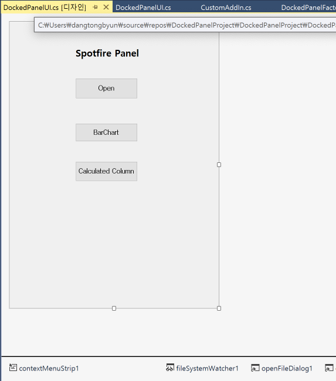

### 5.2 DockedPanel.cs 코드 추가

```{c#}
using Spotfire.Dxp.Application.Visuals;

internal void createColumns()
{
      AnalysisApplication mainApp = GetService<AnalysisApplication>();

      //신규 계산된 컬럼 생성
      mainApp.Document.ActiveDataTableReference.Columns.AddCalculatedColumn("My Calculated Column", "Sqrt([Hits])");

      //Hierarchy Column 추가시
      //List<string> levelExpressions = new List<string>(new string[] { "League", "Team" });
      //HierarchyDefinition definition = new HierarchyDefinition(HierarchyNestingMode.Nested, levelExpressions);
      //cols.AddHierarchyColumn("Team Hierarchy", definition);

       //Binned Column 추가시
       //string binExpression = "binbyevenintervals([Hits], 12)";
       //cols.AddCalculatedColumn("binned hits", binExpression);

 }
```

### 5.3. DockedPanelUI.cs 코드 추가

```{c#}
private void button3_Click(object sender, EventArgs e)
{
       this.panel.createColumns();
}
```

### 5.4 결과 확인

<kbd>Calculated Column</kbd> 을 클릭한뒤, **Data Canvas** 로 이동해서 테이블을 확인하면 아래와 같이 컬럼이 추가 된것을 확인 할 수 있습니다.

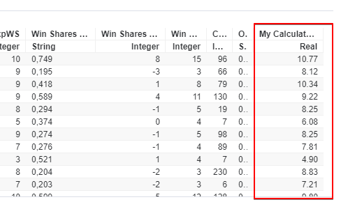
